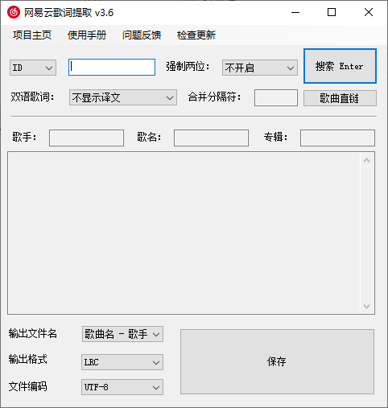

### How To Use

[👉163MusicLyrics User Guide](https://github.com/jitwxs/163MusicLyrics/wiki)

- [x] 支持网易云音乐、QQ音乐两家音乐提供商 Two providers: NetEase Cloud Music and QQ Music are supported
- [x] 支持单曲、专辑、歌单三种查询类别，ID 和完整链接方式均可查询（即精确查询）Support 3 search types: Song, Album, Playlist; 
  you can also search by ID or entire URL (which queries precisely)
- [x] 每种查询类别均支持关键字查询（即模糊查询）Every search type supports searching by keywords (a.k.a. fuzzy search)
- [x] 支持批量查询 && 扫盘查询 Support batch search && search in drive
- [x] 支持多种歌词原文和译文的组织方式 Support multiple original lyrics and translated lyrics compositions
- [x] 支持使用百度翻译、彩云小译 API 翻译歌词 Support using Baidu Translate, LingoCloud APIs to auto-translate lyrics
- [x] 支持提取（部分）歌曲试听链接 Support retrieving the preview link for (some) songs
- [x] 支持多种文件编码格式 && 自定义文件名输出 Support multiple character encoding standards and customizable filenames for exporting
- [x] 支持 LRC 和 SRT 输出格式 Support LRC and SRT formats for exporting
- [x] 日文歌曲支持罗马音 Support rōmaji in Japanese songs
- [x] QQ音乐支持逐字歌词模式（卡拉OK模式）In QQ Music, lyrics synced word-by-word are supported (karaoke mode)

### Downloads

进入 [GitHub Release](https://github.com/jitwxs/163MusicLyrics/releases)
页下载最新版本即可，您可点击 [ChangeLog](https://github.com/jitwxs/163MusicLyrics/wiki/ChangeLog) 查看不同版本的变更。

Enter the [Github Release](https://github.com/jitwxs/163musiclyrics/releses) page to download the latest version, you can
click on [Changelog](https://github.com/jitwxs/163musiclyrics/wiki/changelog) to view the changes in different versions.

**注意:** 为了减少应用的体积，部分非必须功能采用插件形式，具体请参阅 User Guide。

**Attention:** To reduce the application's size，some non-essential features require plugins, please refer to the User Guide for more information.

### Contribution

您可访问 [163MusicLyrics Projects](https://github.com/users/jitwxs/projects/1) 了解项目当前阶段的工作计划，如您愿意在其中贡献力量，您可以：

- 将您的想法或发现的 bug 填写在 [issuses](https://github.com/jitwxs/163MusicLyrics/issues) 中，我将不定期的进行处理
- Fork 项目，并提交您的 pull requests

You can access [163MusiclyRics Projects](https://github.com/Users/jitwxs/projects/1) to learn about the current state of
the project, if you are willing to contribute, you can:

- Write feature suggestions or bug reports to [Issuses](https://github.com/jitwxs/163musiclyrics/issues), I will deal with it sometimes
- Fork the project, and submit your pull requests

### Stargazers over time

### Reference

本项目部分功能借鉴以下项目 Some features of this project took reference from other projects：

- https://github.com/Binaryify/NeteaseCloudMusicApi
- https://github.com/Rain120/qq-music-api
- https://github.com/jsososo/QQMusicApi
- https://github.com/ElliottSilence/LyricCapture
- https://github.com/xmcp/QRCD
- https://github.com/ivanakcheurov/ntextcat
- https://github.com/Cutano/Kawazu

第三方使用介绍视频 Third party use guide videos

- https://www.bilibili.com/video/BV19R4y197on
- https://www.xiaohongshu.com/discovery/item/6399a6aa000000001f00987b

### Donate

如果本项目为您带来方便，欢迎 Star 来让更多人发现和使用它。本项目为个人维护项目，如果您愿意请作者喝一瓶可乐的话，欢迎打赏。

If this project brings you convenience, you're welcome to star it to let more people discover and use it. This project is
maintained personally. If you would like to treat the creator with a bottle of coke, you're welcome to donate.

| username | donate | platform | date |
|:---------|:-------|:-------|:-------|
| 橘橘橘哈 | 3 CNY | wechat | 2023-02-11 |
| p*g | 5 CNY | wechat | 2023-01-26 |
| Draco_Falcon | 5 CNY | wechat | 2023-01-13 |
| *刚 | 3 CNY | wechat | 2023-01-04 |
| **俊 | 1.11 CNY | alipay | 2022-12-27 |
| DJKill | 3 CNY | wechat | 2022-12-20 |
| **远 | 5 CNY | alipay | 2022-12-05 |
| **暄 | 3.5 CNY | alipay | 2022-11-05 |

> 如您选择打赏，记得备注您的昵称，我将为您登记到本页面中。
>
>If you choose to donate, remember to note your nickname, I will register it to this page.

    
    

最后，感谢 JetBrains 为本项目提供 IDE 赞助。

Lastly, thanks to JetBrains for sponsoring the IDE for this project.

